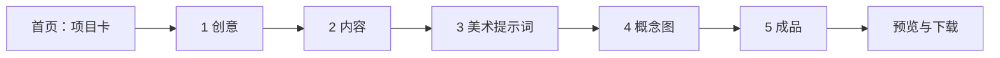

# 创意工作台

> 暂定名称：创意工作台。本文是产品思路与功能方案，更新于 2026-09-06。
>
> **实现状态：仓库目前仍是可运行的空框架。下面的项目卡、创作流程、AI 接口和提示词能力均为待实现方案，不代表已经接入。** 本轮只完善 README，不安装工具、不调用付费生成、不实现业务页面。已有基础架构与验证记录见文末。

让用户从一个想法出发，通过简单的几步操作，逐渐形成完整的创作依据，最后交给 AI 一次发起生成完整作品。

用户主要做三件事：**说出想法、提出修改、保存满意的结果。** 工作台负责整理上下文、编写提示词、调用模型、保存项目和衔接下一步。

## 1. 产品定位与明确边界

### 1.1 工作流



项目内可以点击阶段切换，也可以沿着“继续”一步步完成。已有内容可以直接填入对应阶段。纯文字作品可以跳过美术提示词和概念图。

### 1.2 作品范围

| 类别 | 本项目负责的结果 |
| --- | --- |
| 小说 | 根据设定和内容方案，由 AI 生成完整文本作品 |
| 视频 | 根据脚本、视觉要求和参考集，由 AI 完成视频生成流程 |
| 文创作品 | 根据主题、载体和视觉要求，由 AI 生成数字设计作品及展示结果；具体首批载体待确定 |
| 网站 | 根据页面内容、结构和视觉要求，由 AI 生成网站及可预览、可交付的文件 |

文创暂按数字设计交付规划，实体制造、打样和工艺验证不计入完成范围。网站的实际交付必须区分可运行功能与视觉演示，不能把无行为的按钮当作已实现功能。

### 1.3 概念图范围

概念参考图只包含 **角色、地图、物件**，用途是提供美术参考和最终生成的视觉依据。

- 角色：外貌、服装、气质、形体和姿态的概念参考。
- 地图：空间关系、区域布局、地貌与场景氛围的概念参考。
- 物件：外形、材质、结构特点和装饰细节的概念参考。

它们不承担可直接生产落地的资源制作。不得把概念地图描述成可用关卡，把角色图描述成动画资产，把物件图描述成制造文件。

**Godot 素材制作和导出不属于本项目，使用独立工作台处理。** 不引入游戏引擎、序列帧、地图拼接、交互物编辑等旧工具。

### 1.4 简单操作原则

- 首页只有项目记录，不做工具市场或复杂仪表盘。
- 项目内只展示五个阶段，不要求用户连线、编排节点或选择 Agent。
- 每个阶段以当前结果、一个修改输入框和少量按钮为核心。
- 默认给出一份可以继续使用的结果；只有用户要求时才展开多个候选方案。
- 自动保存进度。刷新、关闭、重新进入项目后，恢复上次内容和所在阶段。
- 模型、API、Prompt 模板和数据结构属于实现细节，默认不出现在创作主流程里。
- 简单操作不等于丢失控制：用户能查看和编辑完整提示词，但不必会写提示词才能使用。

## 2. 首页与项目内操作

### 2.1 首页：项目卡就是所有创意的入口

首页提供“新建创意”、项目卡列表和名称搜索。默认按最近编辑时间排列。

每张卡展示：

| 字段 | 行为 |
| --- | --- |
| 项目名称 | 用户填写，或根据一句话创意自动建议，可随时改名 |
| 项目图片 | 用一张图片代表这个创意，便于识别 |
| 作品类型 | 小说、视频、文创作品、网站；探索初期允许暂未确定 |
| 最近编辑时间 | 帮助寻找近期项目 |
| 当前阶段 | 简单文字，例如“内容”或“概念图”，不展示复杂进度分数 |

点击卡片任何主要区域即可继续工作，默认打开上次停留的阶段。更多菜单只放改名、更换封面、删除项目等低频操作。

项目图片规则：

1. 新项目还没有图片时显示默认占位图片，卡片仍然完整可见。
2. 可以上传已有图片作为封面；第一张保存的概念图也可以自动成为封面，用户已手动选择封面时不再覆盖。
3. 可在“更换封面”中主动选择“AI 生成”，系统根据项目简述编写封面提示词，不额外增加一套操作流程。
4. 不为了填满首页而自动进行付费出图。封面只是项目导航图片，不自动加入概念参考集。
5. 删除封面引用的概念图后，改用其他已保存图片或占位图片，不出现破图。

### 2.2 新建项目

只要求输入一句想法。项目名称可自动建议，作品类型可选，其他字段稍后补充。

操作：**新建创意 → 输入想法 → 创建项目 → 进入“创意”阶段。**

第一次创建就持久化项目，不必生成任何内容才能保存。用户已有完整内容时，可以进入“内容”直接粘贴，不必重新做创意探索。

### 2.3 项目内：一个页面，五个阶段

```text
返回项目列表     项目名称                           已自动保存

  创意  →  内容  →  美术提示词  →  概念图  →  成品

                  当前阶段的主要内容
              文本编辑区 / 图片卡 / 成品预览

            用一句话描述你想如何修改……

                 本阶段操作       继续
```

不采用默认常驻的左中右三栏，不另建聊天历史工作台，也不增加单独的“审核台”“素材库”“流程设计器”。AI 输入框直接服务于当前内容，例如“把这段改得更轻松”或“颜色再淡一些”。

用户可以直接编辑文字。“继续”保存并使用当前版本进入下一步，不再要求额外执行一次“审批”或“确认基线”。如果确有无法生成的关键缺项，就在当前位置提示一个具体问题。

### 2.4 简单但可靠的保存

- 文本输入、当前阶段和临时生成结果自动保存；显示“保存中 / 已保存 / 保存失败”。
- 概念图的“保存”有明确含义：把满意图片加入选定参考集。自动保存候选进度不等于用户已经选定它。
- 切换阶段不触发重新生成，不因刷新页面而再次调用付费 API。
- 修改前面的内容不会删除后面的结果。相关阶段只显示一条轻提示：“前面的内容已更新，需要时可以重新生成。”
- 已发起的生成使用提交时的内容快照，不在生成途中混入后来修改的文字。
- 文本生成失败保留原稿；用户在生成期间又做了编辑时，不让迟到的结果直接覆盖新编辑。

## 3. 阶段一：创意

**目标：把一句话变成足够清晰、值得继续发展的创意。**

### 用户看到什么

上方显示原始想法，下方显示一份可编辑的创意方案。主要按钮为“帮我完善”“换个方向”“继续”。用户有明确想法时，可以直接编辑并继续。

### 具体功能

- 补全主题、核心表达、目标受众和主要吸引力。
- 提出适合当前想法的展开方式，保留用户已指定的事实与限制。
- 按用户要求改变情绪、规模、视角或切入点。
- 用户说“给我三个方向”时，再提供简短候选，选择后仍回到一份当前方案。
- 自动建议项目名称，不擅自为最终作品制定品牌或图标。

### 当前方案包含

一句话概念、作品类型、受众、核心表达、内容简述、必须保留的要点、明确排除的内容。缺少但不影响探索的信息可以暂空。

### 系统操作

读取原始输入与已编辑方案 → 调用文本模型 → 返回结构化内容 → 显示为可读文本 → 自动保存。

这一阶段只生成文字，不自动调用图像 API。进入下一步时仅传递当前方案，不把被放弃的创意混入上下文。

## 4. 阶段二：内容

**目标：完善作品的内容依据，使 AI 知道最终要创作什么。**

界面以一个可编辑文档为中心，根据作品类型显示必要的小节。主要操作是“生成初稿”“按要求修改”“继续”，可选“检查遗漏”。不要让用户填写所有类型共用的一张大表。

| 作品类型 | 内容方案应覆盖 |
| --- | --- |
| 小说 | 故事梗概、人物关系、背景设定、主要冲突、章节结构、结局方向、叙事与语言要求 |
| 视频 | 核心表达、脚本、场景与镜头描述、旁白或对白、节奏、目标时长和画幅 |
| 文创作品 | 创作主题、载体、符号与图案内容、使用场景、必要文字、作品呈现要求 |
| 网站 | 网站目标、受众、页面结构、核心文案、导航和交互要求、交付范围 |

支持直接粘贴已有内容、整篇修改、选中局部修改。用户明确要求保留的文字与设定作为约束，AI 不擅自重写。

默认生成完整的内容方案，而非此时就完成最终作品。小说以内容梗概与章节大纲作为默认准备深度；已有正文可以保留并作为约束，是否增加逐章草稿能力待后续讨论。

后台记录当前内容版本，后续美术方向与概念图对象从这里读取。内容里没有的人物或物件，不因为出图需要而被悄悄写回故事。

## 5. 阶段三：美术提示词

**目标：用文字编写一套完整、可复用的美术方向提示词，供后续概念参考图和成品生成使用。默认不生成任何图片。**

### 5.1 用户操作

1. 系统已经读取创意和内容，用户只需补充一句美术偏好，例如“温暖、手绘、有旧纸质感”。没有偏好时可选择“根据内容建议”。
2. 可选上传参考图片，并补充“只参考配色”或“只参考线条”等说明；不要求用户提供图片。
3. 点击“生成美术提示词”，获得一套文字方案。
4. 用自然语言修改，例如“去掉厚重油画感，改得更轻盈”，也可直接编辑。
5. 点击“继续”，当前方案自动用于概念图。完整提示词提供复制功能。

默认只给一套方向，不要求先看几轮出图再做选择。未来如需要风格试图，可作为用户主动使用的可选功能，不进入默认流程。

### 5.2 要编写哪些内容

| 提示词部分 | 具体说明 |
| --- | --- |
| 视觉定位 | 服务于什么故事、情绪和受众，整体写实或抽象程度 |
| 媒介与表现 | 手绘、摄影感、平涂、版画感等具体表现方式，不能只堆叠“高级、精美” |
| 造型语言 | 比例、轮廓、曲直关系、夸张程度、形体处理 |
| 色彩规则 | 主色倾向、辅助色、饱和度、冷暖与对比度 |
| 光线与氛围 | 光源方向、软硬程度、明暗关系与环境感 |
| 材质与纹理 | 表面细节、笔触、纸感、金属或布料的表达方式 |
| 构图规则 | 视觉焦点、留白、背景复杂度与信息密度 |
| 角色适配规则 | 如何保持人物辨识度、服装表达和形体统一 |
| 地图适配规则 | 如何表达空间层次、区域关系、地貌与场景氛围 |
| 物件适配规则 | 如何表现轮廓、结构与材质，使物件容易看懂 |
| 保持项与排除项 | 用户明确要求保留什么、不要什么 |
| 可直接使用的总提示词 | 将以上规则整理成连贯的文字，供后续调用 |

这些字段由系统整理，不是让用户逐格填写的表单。界面先显示容易阅读的方案，详细提示词按需展开。

### 5.3 如何让 AI 编写美术方向

计划编写 `art-direction` 提示词规范，输入为：当前创意、内容方案、用户美术偏好、可选参考图片及其用途说明。

其指令要点如下，属于本项目拟定模板：

```text
你负责把用户的创作意图转成可执行的美术方向文字。

输入：当前创意、当前内容方案、用户美术偏好、可选参考图片。
任务：编写一套供角色、地图、物件概念图共同使用的美术提示词。

要求：
1. 保留用户已确定的事实、视觉偏好与排除项。
2. 用媒介、造型、色彩、光线、材质和构图描述风格，避免只有抽象赞美词。
3. 将通用美术规则与角色、地图、物件的适配规则分开。
4. 不编造新的角色、剧情、品牌、文化背景或重要物件。
5. 参考图片只用于用户指定的方面；没有图片也能完成任务。
6. 用户已明确的要求优先于默认建议；缺少的视觉细节可提出建议，但不要伪装成既定事实。
7. 输出中文可读方案、可直接拼接的总提示词、分类适配规则、保持项和排除项。
8. 此任务只输出文字，不调用出图能力。
```

后台拟用 JSON Schema 约束结果，至少保存 `summary`、`globalPrompt`、`categoryRules`、`invariants`、`avoid` 和 `userPreferences`。这是本项目内部数据结构，不是图像 API 的参数。

文本编辑后，后续出图以用户当前保存的提示词为准。系统不能在出图前偷偷把旧版本或模型偏好的风格写回去。

### 5.4 需要接入的能力

- **必须：文本生成 API。** 用于组织美术方向和根据用户要求改写。
- **可选：图像理解 API。** 仅在用户上传参考图片时提取其色彩、材质、造型等特征，并依据用户指定的参考范围使用。
- **项目内规范：`art-direction`。** 规定输入、提示词模板、输出结构和禁止擅自补充的内容，待编写。
- **不需要：默认出图服务调用、参考图搜索平台、节点绘图工具或独立美术编辑器。** 用户可以只用文字完成这一阶段。

具体 API 与 Skill 的区别见第 8 节。

## 6. 阶段四：概念参考图

**目标：根据内容和美术提示词生成角色、地图、物件参考；用户只需保存、返工或删除。**

### 6.1 从内容提取需要的对象

进入阶段时，系统根据内容提出一份精简清单，分为角色、地图、物件。每项只显示名称和一句描述。

- 默认列主要对象，不把所有名词自动变成出图任务。
- 用户可删去不需要的项，或输入名称与一句话添加对象。
- 不强制三类齐全，也不规定每类必须生成几张。
- 提取清单不调用图像 API；点击对象的“生成参考图”才开始出图。
- 默认一次生成当前对象的一张图，减少用户同时处理大量候选的负担。

### 6.2 每张图片只保留三个主要操作

| 操作 | 产品行为 | 后台行为 |
| --- | --- | --- |
| 保存 | 满意，加入“已保存参考” | 建立素材卡，加入项目的选定参考集；重复点击不生成重复卡 |
| 返工 | 输入一句修改要求，再生成 | 将当前图片、适用的美术提示词、对象设定和新增修改要求交给图像编辑 API |
| 删除 | 不再需要这张图片 | 从候选或参考集中移除，并清理对应的可删除文件引用；提供短暂撤销，不增设垃圾箱工作区 |

不增加评分、星级、标签体系、审批状态、主辅素材分类或独立素材管理页面。放大查看只是图片本身的预览行为，其他低频信息收在卡片详情中。

“保存”表示用户选定，不表示自动验证为可生产素材。系统可以检查文件是否可读，但不替用户判断审美合格。

### 6.3 返工的完整逻辑

1. 点击当前图片的“返工”。
2. 输入修改要求，例如“衣服改成深蓝色，其他不变”。
3. 系统整理修改项与保持项，携带这张实际图片调用编辑 API。
4. 返回新候选图片，仍然只有保存、返工、删除三个主要操作。
5. 不满意就继续基于当前候选返工；满意后保存。

如果从已保存素材卡发起返工，原有已保存图先保留，新结果保存后才更新该卡及参考集。删除新候选或请求失败都不丢失原图；界面不要求用户管理一棵版本树。

返工不能仅把新的一句话当作文生图请求，也不能只传本地文件路径字符串给远程服务。必须读取并上传实际编辑目标，保留与当前目标对应的设定和提示词版本。

项目美术提示词更新时，已有图片不自动重生成。返工默认沿用该图片的原有风格；用户明确要求应用新风格时才采用新规则，避免“改衣服”意外变成整幅风格重做。

### 6.4 保存后自动生成素材卡

卡片上只显示：缩略图、名称、类别、简短说明。点击详情可查看完整图和实际出图提示词，不暴露模型调用日志。

后台记录生成来源、使用的美术提示词版本、实际 Prompt、图片文件、必要的模型参数和修改关系，以便返工与重开项目。这些记录不转化成复杂操作界面。

**所有已保存卡片自动组成“选定参考集”。** 不再让用户执行一次“加入集合”或“提交审批”。最终生成默认使用保存的参考，未保存候选不进入最终输入。

删除已保存卡片时，立即从当前参考集中移除。之前已经生成的成品和生成记录不随之被删除。任务使用的历史输入快照由系统管理，未来不再引用已删素材。

### 6.5 未保存候选如何处理

未保存候选作为项目草稿恢复，避免关闭页面后丢失返工进度；它们不计入选定参考集。删除候选则取消其草稿引用。文件清理必须遵守引用关系，不误删其他卡片、封面或正在运行任务使用的输入。

已发起请求离开页面后继续记录状态。删除对象时迟到的生成结果不能重新把对象加回参考集；取消请求也不代表供应商一定取消了已产生的费用。

## 7. 出图 Prompt 的具体方案

### 7.1 三层组织

最终发送给图像 API 的 Prompt 由系统自动整理：

```text
项目美术总提示词
+ 当前类别的表现规则
+ 当前角色 / 地图 / 物件的具体设定
+ 本次构图与用途要求
+ 必须保持和禁止添加的内容
+ 可选参考图片的角色说明
```

美术总提示词不包含某个具体角色的专属细节，避免所有物件或地图都被带入同一个角色描述。对象级设定只作用于当前图片。

默认使用清晰的中文提示词；不把“必须改写成英文”设为用户步骤。服务适配器如确有语言转换需要，必须保持语义，不增添新设定，并保存实际发送文本供查看。

### 7.2 通用出图模板

```text
【用途】
为当前创意制作一张{角色/地图/物件}概念参考图，用于美术方向参考。

【整体美术方向】
{已保存的 globalPrompt}

【当前对象】
名称：{对象名称}
已确定设定：{来自内容方案和用户补充的事实}

【类别表现规则】
{categoryRules 中当前类别的内容}

【视角与画面】
{只填写本次需要的视角、构图、背景与可见范围}

【必须保持】
{对象辨识特征、用户明确要求、美术方向约束}

【避免内容】
{不允许的风格或元素；没有文字需求时避免文字、标识、水印}

【参考图片说明，仅在有图时】
图片 1 用于{人物外观/配色/材质/构图}参考；不要复制未指定的其他内容。
```

排除项是自然语言约束，不假设所有供应商都有 `negative_prompt` 参数。尺寸、质量、文件格式属于调用参数，不混写成故事或视觉事实。

### 7.3 分类规则

| 类别 | Prompt 需要明确 | 默认避免 |
| --- | --- | --- |
| 角色 | 可见范围、服饰和体态、辨识特征、姿态、背景复杂度；全身参考时要求形体可读 | 擅自添加武器、宠物、额外角色；未要求的多视图拼板 |
| 地图 | 表达的是区域布局还是场景概念、视角、空间关系、核心地貌、地标与氛围 | 误生成可玩关卡、格子地图或工程精度图；未要求的地名和文字 |
| 物件 | 单个对象的轮廓、主要部件、材质、结构关系、尺度感和展示角度 | 擅自增加配件或标识；把展示图描述成可制造图纸 |

用户未指定视角时可以采用适合阅读的默认值：角色以能看清造型为准，地图布局与场景概念分别采用合适视角，物件以结构可读为准。这些都是可修改建议，不反向变成剧情设定。

### 7.4 完整出图示例

以下是说明 Prompt 组织方式的虚构示例，不是项目自带人物、预设风格或默认素材：

```text
【用途】
生成一张名为“林间邮差”的角色概念参考图，仅用于创作美术参考。

【整体方向】
温暖、安静的手绘绘本表现。造型略带概括感，使用柔和的曲线和清晰轮廓。
以低饱和绿色、米白色和少量棕色构成画面，保留轻微纸张与铅笔纹理。
光线柔和，明暗层次简洁，避免高反光与强烈戏剧性打光。

【对象设定】
成年邮差，短发，穿绿色外套，携带棕色邮包。表情平和。
这些是本例已经确定的设定，不增加武器、动物伙伴或其他身份象征。

【画面】
单人全身参考，人物姿态自然，外套和邮包结构清楚，背景简洁。
画面重点是轮廓、服饰和气质，不绘制完整剧情场景。

【保持与避免】
保持绿色外套、棕色邮包和安静气质。
不添加文字、水印、品牌标识、其他角色或多视图分栏。
```

### 7.5 返工 Prompt 模板与示例

返工前先提取 `editInstruction` 与 `preserve`，不把整段聊天历史拼接成提示词。修改项与保持项有冲突时，以用户本次明确修改为准；含义不清且会影响主体身份时再提出一个简短问题。

```text
【编辑目标】
图片 1 是本次需要修改的原图，请基于它编辑。

【本次修改】
将角色的绿色外套改为深蓝色。

【保持不变】
保持人物面部、发型、体态、姿势、棕色邮包、背景、构图及光线。
保持原图的手绘绘本表现、纸张纹理和整体低饱和倾向。
外套颜色是本次明确修改，不再要求保持绿色。

【其他约束】
不增加角色、道具、文字或水印。
```

“保持不变”是模型指令，不是像素级不变的保证。默认先做自然语言返工；复杂蒙版编辑不作为第一版必需操作。是否满足要求最终由用户决定保存或继续返工。

## 8. Skill、API 与工具接入方案

本节面向实现与讨论，不放进普通用户的阶段操作页面。以下均为拟接入或拟编写项。

### 8.1 区分三种职责

| 层 | 作用 | 本项目的使用方式 |
| --- | --- | --- |
| Skill / 提示词规范 | 规定如何理解任务、组织输入、生成 Prompt 和检查结果 | 把稳定规则写入项目并版本化，由服务端显式读取；需要外部 Agent 操作时可再包装为 Skill |
| 模型 API | 实际完成文字生成、图片理解、出图和编辑 | 由服务端适配器调用，负责模型参数和响应处理 |
| 本地工具 | 保存文件、生成缩略图、整理卡片和任务状态 | 确定性代码完成，不让模型承担文件路径和状态管理 |

本机安装的 Skill 不会因为存在于开发环境就自动成为网页功能。开发期可参考现有 `imagegen` 的提示词与编辑原则、使用 `openai-docs` 核对接口；正式工作台需要自己的服务端实现，不依赖某个开发者当前打开的对话或宿主内置出图工具。

### 8.2 拟编写的项目规范

| 名称（拟定） | 输入 | 输出与职责 |
| --- | --- | --- |
| `creative-brief` | 原始想法、用户修改、当前方案 | 当前创意方案，不自动出图 |
| `content-development` | 创意、作品类型、已有文稿 | 适合该类型的内容方案 |
| `art-direction` | 创意、内容、视觉偏好、可选参考图说明 | 美术总提示词、分类规则、保持与排除项，只输出文字 |
| `concept-prompt` | 对象设定、美术提示词、本次请求 | 生成模式、最终出图 Prompt、图片用途说明与编辑保持项 |
| `final-brief` | 当前内容、视觉规则、已保存素材卡、交付要求 | 单次成品生成所需的完整输入包 |

这些是逻辑模块，不意味着启动多个独立 Agent。第一版采用明确的阶段调用，避免为简单流程引入多 Agent 协作与复杂调度。

建议未来将文本模板和结构定义放入 `workbench/prompts/` 与相关 schema 文件；本轮不创建这些文件，也不安装第三方 Skill。

### 8.3 API 建议

建议第一版先用同一供应商完成文字与概念图链路，减少配置与返回格式差异；图像适配器仍保留替换能力。以下是以 OpenAI 为例的首选接入方案，最终模型需在开发时确认账户可用性，并用实际样例验证。

| 用途 | 建议接口 | 调用方式 |
| --- | --- | --- |
| 创意、内容、美术提示词、出图 Prompt 编写 | OpenAI Responses API | 输入当前阶段上下文，返回文本或结构化字段；文本模型通过服务端配置选择 |
| 从用户参考图中分析视觉特征 | 支持图像输入的 Responses 模型 | 图片与“只分析配色”等明确说明一起输入，返回文字，不替用户选定风格 |
| 无参考图的新概念图 | Images API，`POST /v1/images/generations` | 发送编译后的 Prompt 和所需输出参数 |
| 基于图片返工，或携带图片进行参考创作 | Images API，`POST /v1/images/edits` | 发送实际图片与新 Prompt；在指令中区分编辑目标和风格参考 |

Responses 可用结构化输出组织内部字段，但格式正确不代表内容正确，仍需处理拒绝、截断和业务校验。依据：[Structured Outputs](https://developers.openai.com/api/docs/guides/structured-outputs)。图像理解接口依据：[Images and vision](https://developers.openai.com/api/docs/guides/images-vision)。

图像模型建议以 `gpt-image-2` 作为首轮验证对象，其官方说明支持图片生成与编辑。依据：[模型说明](https://developers.openai.com/api/docs/models/gpt-image-2)。上述生成与编辑端点的用途依据：[Image generation](https://developers.openai.com/api/docs/guides/image-generation)。

这里选择独立 Images API，是为了让应用明确持有编辑目标和实际 Prompt，并统一处理保存、返工、删除；不是要求用户手动配置 API。

### 8.4 图像适配器要怎样实现

建议定义两个核心操作：`generateConcept` 与 `editConcept`。它们是未来内部接口名称，不是已经存在的 MCP 工具。

请求至少包含：项目 ID、对象 ID、当前对象描述、实际 Prompt、输入图片引用、输出比例偏好、此次请求的唯一 ID。

- `generateConcept`：没有输入图片时调用生成端点；携带参考图时走支持图片输入的路径，并明确参考范围。
- `editConcept`：读取当前候选或素材卡的实际文件，以图片输入携带新增修改要求，不伪装成普通文字生成。
- 输出图先写到本项目任务目录，验证文件可读后才在界面显示成功；不能把供应商临时链接当作永久项目存储。
- 初版默认一张图、普通参考质量；用户侧只提供必要的横图、竖图、方图选择。具体尺寸与质量由适配器映射到模型支持的参数。
- 不跨供应商生搬硬套 seed、steps、CFG、LoRA 或负向提示词字段。`gpt-image-2` 的 `input_fidelity` 应省略，按该模型接口处理。依据：[图像输入保真度](https://developers.openai.com/api/docs/guides/image-generation#image-input-fidelity)。
- 返工请求保存目标图片 ID、用户原话、实际 Prompt 和必要的父结果引用，使连续修改始终基于正确图片。
- 不承诺固定种子或 Prompt 能绝对保证人物一致；利用已保存图片作为参考，并保留用户保存决定。

### 8.5 需要哪些本地工具

| 工具或组件 | 用途 | 计划 |
| --- | --- | --- |
| Node.js 服务端与供应商 SDK / HTTP 客户端 | 调用模型、读取上传图片、处理流式文字与生成响应 | 沿用当前服务端架构，接入时增加对应 SDK |
| JSON Schema 校验 | 保证阶段结果的字段可读取、缺项可识别 | 用于 Prompt 结果与项目数据，不生成大量用户表单 |
| 图像解码与缩略图组件 | 检查图片可打开、生成项目卡和素材卡缩略图 | 按需要选择轻量组件，不承担创作性修图 |
| 本地文件存储与项目索引 | 保存项目、图片、阶段文字和任务 | 第一版本地优先，不要求搭建外部数据库 |
| 简单后台任务队列 | 出图期间可离开页面，重开后恢复状态 | 记录请求与结果，避免重复提交 |

不将 Photoshop、ComfyUI、节点编辑器、复杂素材库或额外商业平台设为第一版前置条件。后续只有在实际需求证明必要时才增加适配器。

### 8.6 配置、费用与失败处理

设置页一次配置文本和图像服务，主流程无需反复选择模型。密钥在服务端环境或受保护配置中保存，不写入浏览器存储、素材卡或日志。

用户点击“生成”或“返工”即发起对应生成请求；同一次请求不再层层确认。可在按钮附近显示预计消耗信息，无法可靠估计时不编造价格。

防重复提交、请求状态持久化和错误处理属于后台责任。连接超时但供应商可能已接收时，标记结果待核实，不自动再发一次有费用的生成；普通轮询只查询已有任务。本地任务 ID 不等于供应商保证的幂等键。

未配置服务时显示简短的设置入口；失败时保留当前文字、原图与用户修改要求。文案区分“未配置”“生成失败”“结果待核实”和“生成完成”。

## 9. 阶段五：成品生成与交付

保留当前思路：用户一次发起，AI 完成最终作品，用户不手工组装。

### 9.1 操作

1. 进入“成品”，系统自动整理前面已保存的内容。
2. 页面展示简短的生成摘要与必要交付选项，不增加单独准备阶段。
3. 用户点击“生成完整作品”。
4. 系统完成生成与适当检查，显示预览及下载。
5. 需要修改时输入一句要求，生成新的结果，原成品先保留。

### 9.2 传入最终生成的内容

当前创意、内容方案、美术提示词、已保存参考集、作品类型、交付要求。自动排除未保存候选、已删除素材和被放弃的聊天内容。

按任务保存一份输入快照。后续改动不会让已运行任务的生成依据发生漂移。

### 9.3 四种结果

| 类型 | 用户获得什么 | 应检查什么 |
| --- | --- | --- |
| 小说 | 完整正文、阅读预览和可编辑文件 | 必要章节和结尾存在，文件可读，没有遗漏的占位内容 |
| 视频 | 可播放视频及约定的附属文件 | 文件可播放，画幅、时长及必要内容符合约定 |
| 文创作品 | 数字设计方案、展示结果和约定文件 | 载体、必要文字、展示视图及文件完整；不宣称已经可量产 |
| 网站 | 网站预览、源码及运行说明 | 页面可访问、指定交互可运行，区分演示与真实功能 |

一次性指用户操作上提交一次，不要求内部只调用一次模型。需要多个处理步骤时由后台完成，但不能通过手工补内容、剪辑或搭建来弥补系统缺失。

前置概念图始终是参考。成品内部需要的最终画面、排版或代码由成品生成模块负责，不扩展为用户手工管理的生产素材流程。

小说长度、视频时长与供应商能力等具体限制，在各成品适配器接入后验证并呈现。没有接入的产物类型应明确不可生成，不用占位文件冒充结果。成品模型与供应商本轮不锁定，优先完成前四阶段的体验。

## 10. 供开发使用的最小数据与架构

本节的复杂度留在后台，不增加前台步骤。

### 10.1 最小数据

| 对象 | 主要保存内容 |
| --- | --- |
| Project | 项目名称、封面引用、作品类型、当前阶段、创建与修改时间 |
| StageContent | 当前创意、内容、美术提示词及其必要版本标识 |
| ConceptDraft | 对象类别与设定、当前候选、返工输入和待处理请求 |
| ReferenceCard | 保存的图片、名称、类别、说明、生成依据；属于当前选定参考集 |
| GenerationTask | 输入快照、请求 ID、真实执行状态、结果或错误 |
| FinalResult | 成品类型、文件位置、预览信息、对应生成依据 |

不先引入复杂标签系统、跨项目素材市场、多人审批、版本分支编辑器或通用流程图引擎。

### 10.2 分层与存储

沿用当前框架：页面与组件 → HTTP 接入 → 共享 Runtime → 能力适配器。CLI/MCP 可以复用同一运行时，但普通用户只需使用网页。

拟定结构，尚未创建：

```text
features/projects/            项目卡与项目恢复
features/creative-flow/       五阶段导航与当前内容
features/concept-images/      概念图的保存、返工、删除
features/final-output/        成品生成与预览
workbench/prompts/            阶段 Prompt 规范
lib/workbench/adapters/       文本、图片与成品服务适配器
work/projects/<project-id>/   项目文本、图片与必要记录
outputs/<task-id>/            成品交付
```

项目记录以服务端持久化为准，浏览器只缓存临时交互。图片保存为受控文件，不把全部 Base64 塞进项目 JSON。删除和缩略图清理根据引用关系进行。

仅将实际实现且可用的能力登记到 `workbench/manifest.json`，不预注册看似可用的空工具。外部 API 请求由服务端进行，默认本地服务保持回环访问。

## 11. 实施顺序与验收

| 阶段 | 实施内容 | 通过标准 |
| --- | --- | --- |
| P0 当前状态 | 空框架与方案文档 | 当前仓库可运行；本文明确设计与实现的区别 |
| P1 项目与操作骨架 | 项目卡、占位封面、五步导航、编辑与自动保存 | 新建、改名、关闭后恢复、从卡片继续工作；不需要 AI 服务即可验证 |
| P2 文字工作流 | 创意、按类型组织内容、美术提示词、自然语言修改 | 前三阶段顺畅衔接；美术阶段默认零图像生成调用；完整 Prompt 可复制编辑 |
| P3 概念图闭环 | 对象清单、真实出图与带图返工、三按钮、素材卡与参考集 | 实际生成一张图、返工一次、保存后进入参考集；删除可撤销，刷新不重复计费请求 |
| P4 完整交付 | 生成摘要、单任务输入包、接入一类真实成品生成 | 一次点击产生该类型的完整结果，可预览下载；不要求用户手工组装 |
| P5 扩展产物 | 逐步接入其他作品类型 | 每类单独验证真实能力与限制，共用简洁的前置工作流 |

P4 首个成品类型，以及文创首批载体，仍待共同确定。可以先完成共用流程，不提前替用户决定。

### 端到端验收例

创建一个创意项目 → 得到内容方案 → 生成文字美术提示词 → 生成一个角色参考 → 输入一句话返工 → 保存成为素材卡 → 返回首页看到项目卡 → 再次进入恢复原进度 → 使用选定参考集发起成品生成。

还应验证：不做美术的纯文字路径能继续；没有任何已保存参考也能生成允许无参考的作品；前面内容改变不覆盖已保存图片；删除的候选不进入最终生成；缺少服务时不展示虚假完成状态。

## 12. 当前框架的启动与文档

以下命令对应目前已存在的空框架，不代表上述业务功能已完成。

需要 Node.js 22.13+ 和 npm，在仓库根目录执行：

```powershell
npm ci
npm run dev
```

Web：<http://localhost:3001>。本地 Runtime：<http://127.0.0.1:8791>。当前首页仍为空白。

```powershell
npm test
npm run lint
npm run typecheck
npm run build
npm run workbench -- list
npm run workbench -- doctor
```

当前 CLI 只有发现和诊断，HTTP 只有健康检查与空能力发现，MCP 只有只读 manifest。业务能力列表仍为空。`package.json` 中 `app-scaffold` 是技术占位，产品暂定名在本文中定义为“创意工作台”；UI、图标和包名本轮未修改。

本文定义接下来讨论和实现的产品方向；[架构说明](docs/architecture.md)、[既有计划](docs/IMPLEMENTATION_PLAN.md)与[框架验证](docs/BASELINE_VERIFICATION.md)记录此前空框架阶段，不能当作上述产品能力已完成的证明。[来源说明](docs/UPSTREAM.md)与 [LICENSE](LICENSE)保留参考项目来源和许可。

API 能力依据在相关段落提供了官方链接，核对日期为 2026-09-06；实际接入时再确认模型可用性、接口参数和费用。本次没有执行真实文字或图像 API 请求。
